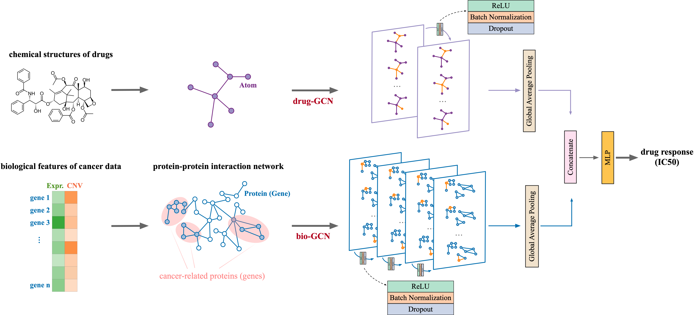

# DualGCN

This repository demonstrates how to use the [IMPROVE library v0.0.3-beta](https://github.com/JDACS4C-IMPROVE/IMPROVE/tree/v0.0.3-beta) for building a drug response prediction (DRP) model using DualGCN, and provides examples with the benchmark [cross-study analysis (CSA) dataset](https://web.cels.anl.gov/projects/IMPROVE_FTP/candle/public/improve/benchmarks/single_drug_drp/benchmark-data-pilot1/csa_data/).

This version, tagged as `v0.0.3-beta`, is the final release before transitioning to `v0.1.0-alpha`, which introduces a new API. Version `v0.0.3-beta` and all previous releases have served as the foundation for developing essential components of the IMPROVE software stack. Subsequent releases build on this legacy with an updated API, designed to encourage broader adoption of IMPROVE and its curated models by the research community.

A more detailed tutorial can be found [here](https://jdacs4c-improve.github.io/docs/content/unified_interface.html). 
`TODO`: update with the new docs!


## Dependencies
Installation instuctions are detialed below in [Step-by-step instructions](#step-by-step-instructions).

Conda `yml` file [conda_env_py37.sh](./conda_env_py37.sh)

ML framework:
+ [TensorFlow](https://www.tensorflow.org) -- deep learning framework for building the prediction model
+ [Networkx](https://networkx.org/documentation/stable/index.html) -- Graph and Complex Networks.

IMPROVE dependencies:
+ [IMPROVE v0.0.3-beta](https://github.com/JDACS4C-IMPROVE/IMPROVE/tree/v0.0.3-beta)
+ [candle_lib](https://github.com/ECP-CANDLE/candle_lib) - IMPROVE dependency (enables various hyperparameter optimization on HPC machines) `TODO`: need to fork into IMPROVE project and tag


## Dataset
Benchmark data for cross-study analysis (CSA) can be downloaded from this [site](https://web.cels.anl.gov/projects/IMPROVE_FTP/candle/public/improve/benchmarks/single_drug_drp/benchmark-data-pilot1/csa_data/).

The data tree is shown below:
```
csa_data/raw_data/
├── splits
│   ├── CCLE_all.txt
│   ├── CCLE_split_0_test.txt
│   ├── CCLE_split_0_train.txt
│   ├── CCLE_split_0_val.txt
│   ├── CCLE_split_1_test.txt
│   ├── CCLE_split_1_train.txt
│   ├── CCLE_split_1_val.txt
│   ├── ...
│   ├── GDSCv2_split_9_test.txt
│   ├── GDSCv2_split_9_train.txt
│   └── GDSCv2_split_9_val.txt
├── x_data
│   ├── cancer_copy_number.tsv
│   ├── cancer_discretized_copy_number.tsv
│   ├── cancer_DNA_methylation.tsv
│   ├── cancer_gene_expression.tsv
│   ├── cancer_miRNA_expression.tsv
│   ├── cancer_mutation_count.tsv
│   ├── cancer_mutation_long_format.tsv
│   ├── cancer_mutation.parquet
│   ├── cancer_RPPA.tsv
│   ├── drug_ecfp4_nbits512.tsv
│   ├── drug_info.tsv
│   ├── drug_mordred_descriptor.tsv
│   └── drug_SMILES.tsv
└── y_data
    └── response.tsv
```

Note that `./_original_data` contains data files that were used to train and evaluate the DualGCN for the original paper.


## Model scripts and parameter file
+ `dualgcn_preprocess_improve.py` - takes benchmark data files and transforms into files for trianing and inference
+ `dualgcn_train_improve.py` - trains the DualGCN model
+ `dualgcn_infer_improve.py` - runs inference with the trained DualGCN model
+ `dualgcn_params.txt` - default parameter file


# Step-by-step instructions

### 1. Clone the model repository
```
git clone git@github.com:JDACS4C-IMPROVE/DualGCN.git
cd DualGCN
git checkout legacy-v0.0.3-beta
```


### 2. Set computational environment
Option 1: create conda env using `yml`
```
conda env create -f environment.yml
```

Option 2: check [environment_setup.sh](./environment_setup.sh)


### 3. Run `setup_improve.sh`.
```bash
source setup_improve.sh
```

This will:
1. Download cross-study analysis (CSA) benchmark data into `./csa_data/`.
2. Clone IMPROVE repo (checkout tag `v0.0.3-beta`) outside the GraphDRP model repo
3. Set up env variables: `IMPROVE_DATA_DIR` (to `./csa_data/`) and `PYTHONPATH` (adds IMPROVE repo).


### 4. Preprocess CSA benchmark data (_raw data_) to construct model input data (_ML data_)
```bash
bash preprocess_example.sh
```

Preprocesses the CSA data and creates train, validation (val), and test datasets.

Generates:
* Drug features saved in `Drug_id.hkl` files. 
* Cell line information (both Gene Expression and CNV) saved in `cell_line_improve_id.csv` files.
* Three tabular data files, each containing the drug response values (i.e. AUC) and corresponding metadata: `train_y_data.csv`, `val_y_data.csv`, `test_y_data.csv`. 

The constructed tree is shown below:
```
ml_data
└── gCSI-gCSI
    ├── split_0
    │   ├── drug_features
    │   │   ├── Drug_0.hkl
    │   │   ├── Drug_1.hkl
    │   │   ├── ...
    │   │   └── Drug_last_id.hkl
    │   ├── test_y_data.csv
    │    ├── train_y_data.csv
    │    └── val_y_data.csv
    ├── split_0_omics_data
    │    ├── cell_line_0.csv
    │    ├── cell_line_1.csv
    │    ├── ...
    │    └── cell_line_last_id.csv
    ├── split_0_PPI
    │   └── PPI_network_new.txt
    └── split_0gene_list.txt
```

These files are used in the training stage to build both the molecular graph and the drug graph. The PPI network comes from the original paper. 

### 5. Train GraphDRP model
```bash
python dualgcn_train_improve.py
```

Trains DualGCN using the model input data.

Generates:
* trained model: `model.h5`
* predictions on val data (tabular data): `val_y_data_predicted.csv`
* prediction performance scores on val data: `val_scores.json`
```
out_models
└── GDSCv1
    └── split_0
        ├── best -> /lambda_stor/data/apartin/projects/IMPROVE/pan-models/GraphDRP/out_models/GDSCv1/split_0/epochs/002
        ├── epochs
        │   ├── 001
        │   │   ├── ckpt-info.json
        │   │   └── model.h5
        │   └── 002
        │       ├── ckpt-info.json
        │       └── model.h5
        ├── last -> /lambda_stor/data/apartin/projects/IMPROVE/pan-models/GraphDRP/out_models/GDSCv1/split_0/epochs/002
        ├── model.pt
        ├── out_models
        │   └── GDSCv1
        │       └── split_0
        │           └── ckpt.log
        ├── val_scores.json
        └── val_y_data_predicted.csv
```


### 6. Run inference on test data with the trained model
```python dualgcn_infer_improve.py```

Evaluates the performance on a test dataset with the trained model.

Generates:
* predictions on test data (tabular data): `test_y_data_predicted.csv`
* prediction performance scores on test data: `test_scores.json`
```
out_infer
└── GDSCv1-CCLE
    └── split_0
        ├── test_scores.json
        └── test_y_data_predicted.csv
```

<!-- DualGCN: a dual graph convolutional network model to predict cancer drug response

DualGCN is a unified Dual Graph Convolutional Network model to predict cancer drug response. It takes chemical structure information of a drug and gene features of a cancer sample as inputs and outputs IC50.

 
 
 # Requirements
- Keras == 2.1.4
- TensorFlow == 1.13.1
- hickle == 2.1.0
- numpy >= 1.19.2
- scipy >= 1.5.2
- sklearn >= 0.24.2
- pandas >= 1.1.3

# Installation
DualGCN can be downloaded by
```shell
git clone https://github.com/horsedayday/DualGCN
```
Installation has been tested in a Linux/MacOS platform.

# Instructions
## Cell line data preparation
We collected gene expression and copy number variation data from [CCLE database](https://depmap.org/portal/download/). These gene features of cell lines could be found in `data/CCLE/omics_data`. We curated cancer-related genes from the TCGA and COSMIC. These genes were used and could be found in `data/CCLE/gene_list.txt`. We filtered out cell lines if (1) either gene expression or CNV data are unavailable, or (2) cancer type annotations are missed, or (3) sample size of the corresponding cancer type is less than 10. Finally, we collected 525 cell lines covering 27 kinds of cancers. Lists of these cell lines could be found in `data/CCLE/cellline_list.txt`. We built graphs of cancer samples with protein-protein interactions (PPIs). These PPIs were obtained from [STRING database](https://string-db.org/) (version 11.0). These PPI data could be found in `data/PPI/PPI_network.txt`. 

## Drug data preparation
Drug information was obtained from the [GDSC database](https://www.cancerrxgene.org/compounds)(version: GDSC1). We only kept drugs that are recorded in the PubChem. In addition, drugs sharing the same PubChem identifiers but owning different GDSC identifiers were also filtered out. Finally, we collected 208 drugs. We applied [deepchem](https://github.com/deepchem/deepchem) library to extract features of atoms of drugs. The parsed features and adjacency information of drugs were put in `data/drug/drug_graph_feat`.

## DualGCN prediction
Main function and models were put in the code folder. 

```python
python DualGCN.py
```

The trained model will be saved in `checkpoint`. The predicted response and evaluation metrics (such as Pearson's correlation, Spearman's correlation) will output in `log`.

# License
This project is licensed under the MIT License - see the LICENSE.md file for details -->


